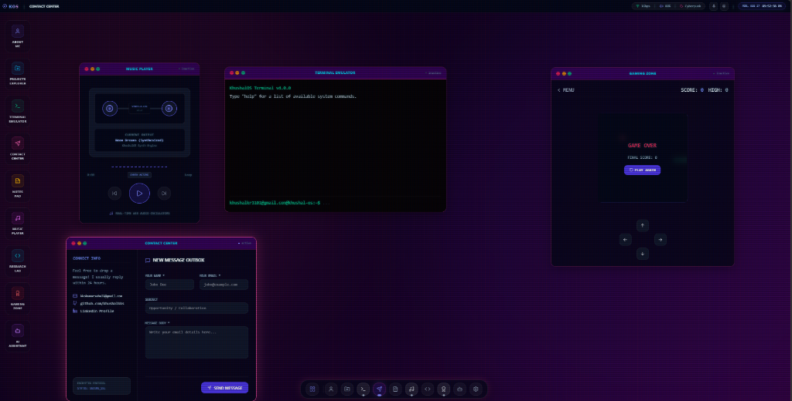
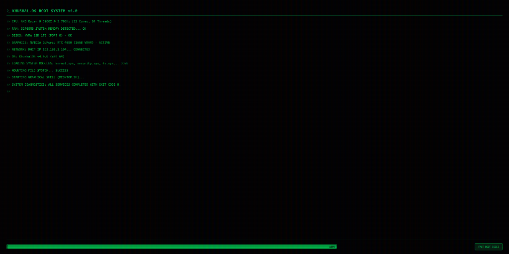
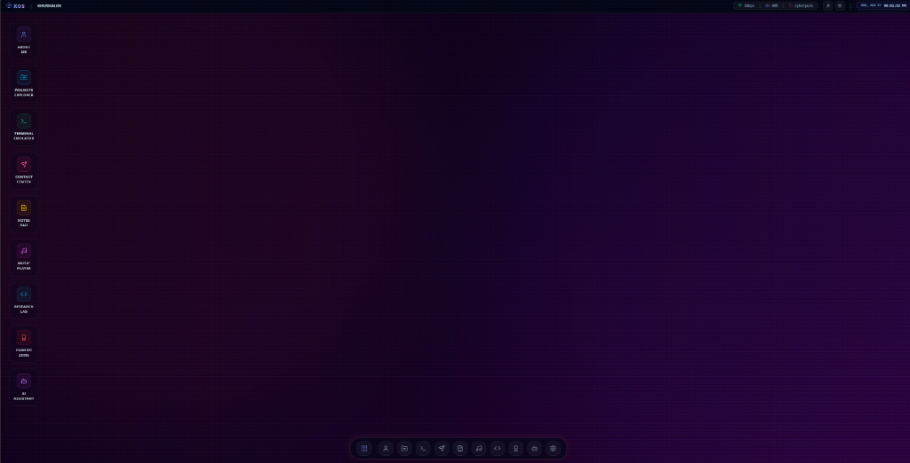

<div align="center">

# 🌌 KhushalOS — Next-Gen Interactive Web OS & Gaming Portfolio

An ultra-futuristic, high-fidelity **Glassmorphic Operating System Simulator** built on the web. Replicating a full-fledged desktop environment with dynamic window management, AI assistance, retro gaming, synthesized Web Audio, custom terminal CLI, and cyberpunk visuals.

[](https://react.dev/)
[](https://www.typescriptlang.org/)
[](https://vitejs.dev/)
[](https://tailwindcss.com/)
[](https://zustand-demo.pmnd.rs/)
[](https://ai.google.dev/)

</div>

---

## 📸 System Showcase & Visuals

### 🖥️ Multitasking Desktop Workspace
> Active multi-window workspace running the Synthesizer Music Player, Interactive Terminal, Contact Center, and Retro Gaming Zone simultaneously with active neon glow highlights and frosted glass reflection.



<br/>

### ⚡ System Boot Sequence v4.0
> Cyberpunk green phosphor retro CRT boot screen with real-time diagnostic hardware checks, module mounting, and fast boot bypass options.



<br/>

### 🌌 Clean Cyberpunk Desktop & Floating Glass Dock
> Immersive desktop shell with top system status menu, floating macOS-inspired dynamic zoom dock, and custom side app launcher panel.



---

## ✨ Features & Operating System Apps

| App / Feature | Icon | Description |
| :--- | :---: | :--- |
| **Cortex AI Assistant** | 🤖 | Powered by **Google Gemini 1.5 Flash** API with conversational memory, code sandbox with one-click copy, and offline local simulation mode fallback. |
| **Terminal Emulator** | 💻 | Custom CLI environment with support for commands like `neofetch`, `matrix`, `help`, `cat`, `ls`, `theme`, and interactive system feedback. |
| **Retro Gaming Zone** | 🎮 | Arcade suite featuring retro games (*Snake*, *Space Shooter*, *Memory Match*, *Dodge*) with live scoreboards, XP levels, and system achievements. |
| **Synthesizer Music Player**| 🎵 | Real-time procedural music synth built with the native **Web Audio API Oscillators**, generating synthwave arpeggios and audio wave visualizers. |
| **Projects Explorer** | 📁 | Interactive portfolio showcase displaying project cards with tech stack badges, deep summaries, live demo links, and GitHub repository links. |
| **Notes Pad Editor** | 📝 | Persistent note-taking workspace saved directly into `localStorage` with real-time text formatting, search, and categorization. |
| **Contact Center** | 📬 | Direct email and messaging transmission suite with pre-formatted outgoing mail client UI and social networking channels. |
| **Voice Controller** | 🎙️ | Hands-free speech recognition system allowing users to invoke system operations, launch applications, and query system stats by voice. |
| **Control Center & Themes**| 🎛️ | Quick settings panel for system volume, CRT monitor scanlines toggle, audio effects, and themes (*Cyberpunk, Matrix, Dark Glass, Neon Sunset*). |
| **Interactive Boot Loader**| 🚀 | System initialization sequence featuring POST hardware scans, memory detection logs, and Fast-Boot override (`ESC`). |

---

## 🛠️ Tech Stack & Architecture

- **Core Framework:** [React 19](https://react.dev/) + [TypeScript](https://www.typescriptlang.org/) + [Vite](https://vitejs.dev/)
- **State Management:** [Zustand 5](https://zustand-demo.pmnd.rs/) (Optimized store for active window instances, z-indexes, audio context, and user settings)
- **Styling & UI Effects:** [Tailwind CSS v4](https://tailwindcss.com/) with custom backdrop blur glassmorphism, glowing borders, and CSS scanline overlays
- **Icons & Visuals:** [Lucide React Icons](https://lucide.dev/) + Custom SVG Brand Vector Sets
- **Audio Engine:** Native Browser **Web Audio API** (Oscillators, GainNodes, BiquadFilters)
- **Speech Synthesis & Input:** Browser **Web Speech API** (`SpeechRecognition` & `SpeechSynthesis`)
- **AI Integration:** [@google/generative-ai](https://www.npmjs.com/package/@google/generative-ai) (Gemini 1.5 Flash API)

---

## 📁 Repository Directory Structure

```
OS_Gaming/
├── docs/
│   └── screenshots/         # Screenshots featured in README
│       ├── boot-system.png
│       ├── desktop-clean.png
│       └── desktop-workspace.png
├── public/                  # Static assets & icons
│   └── screenshots/
├── src/
│   ├── apps/                # Standalone Desktop Applications
│   │   ├── AIApp.tsx        # Cortex AI Assistant (Gemini API)
│   │   ├── AboutApp.tsx     # Portfolio Bio & Career Timeline
│   │   ├── ContactApp.tsx   # Contact Form & Socials
│   │   ├── GamesApp.tsx     # Retro Gaming Suite & Achievements
│   │   ├── MusicApp.tsx     # Web Audio API Synth Engine
│   │   ├── NotesApp.tsx     # LocalStorage Persistent Notepad
│   │   ├── ProjectsApp.tsx  # Interactive Portfolio Projects
│   │   ├── ResearchApp.tsx  # Research & Development Notebook
│   │   ├── SettingsApp.tsx  # OS Customizer & Preferences
│   │   └── TerminalApp.tsx  # Interactive Command-Line Shell
│   ├── components/          # System Core Components
│   │   ├── BootScreen.tsx   # Retro CRT Boot Diagnostics
│   │   ├── Desktop.tsx      # Main Desktop Grid & Drag Surface
│   │   ├── MenuBar.tsx      # Top System Status Bar
│   │   ├── QuickSettings.tsx# Quick Controls & CRT Toggle
│   │   ├── StartMenu.tsx    # OS Application Launcher
│   │   ├── Taskbar.tsx      # Dynamic Floating Dock Launcher
│   │   ├── VoiceController.tsx # Voice Command System
│   │   └── Window.tsx       # Resizable/Draggable Window Container
│   ├── store/               # Zustand Global State Management
│   └── index.css            # Custom CSS Tokens & Animations
└── package.json
```

---

## ⚡ Quick Start & Local Setup

Follow these steps to get KhushalOS running locally on your machine:

### 1. Prerequisites
Ensure you have **Node.js** (v18.0 or higher) and **npm** installed on your system.

### 2. Clone Repository & Install Dependencies
```bash
git clone https://github.com/khushalkks/Learning_desktop.git
cd Learning_desktop
npm install
```

### 3. Configure Gemini AI API Key (Optional)
To enable real-time cloud responses in the **Cortex AI Assistant**:
Create a `.env` file in the root directory:
```env
VITE_GEMINI_API_KEY=your_google_gemini_api_key_here
```
*(Note: If no API key is provided, Cortex AI will automatically run in **Offline Simulation Mode** with built-in instant local responses!)*

### 4. Run Development Server
```bash
npm run dev
```
Open your browser and navigate to `http://localhost:5173`. Click **FAST BOOT [ESC]** or wait for the system checks to finish, then click **SIGN IN** to launch the OS!

---

## 🎮 OS Controls & Keybindings

- `ESC` / **Fast Boot Button:** Bypass boot loader diagnostic sequence.
- **Window Drag & Drop:** Click and hold any window's title bar to reposition.
- **Window Controls:**
  - 🔴 **Red Dot:** Close window
  - 🟡 **Yellow Dot:** Minimize window to dock
  - 🟢 **Green Dot:** Maximize / Restore window size
- **Dock Zoom:** Hover over bottom dock icons for macOS-style smooth scaling.
- **Voice Commands:** Click the microphone icon in the menu bar to activate hands-free control.

---

## 👤 Author & Credits

Designed and developed by **Khushal** (`khushalkks`).

- 🌐 **GitHub:** [@khushalkks](https://github.com/khushalkks)
- 📧 **Email:** [khushalsaini3101@gmail.com](mailto:khushalsaini3101@gmail.com)

---

<div align="center">
  <sub>Built with ❤️ using React 19, TypeScript, Tailwind CSS v4 & Google Gemini AI.</sub>
</div>
